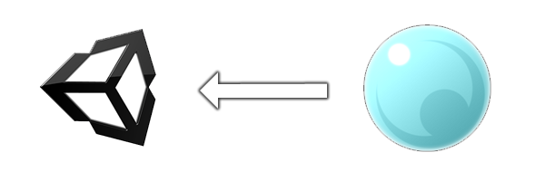

# Effekseer UnityPlugin Manual



## Overview {#overview}

It is explanation about cooperation with game engine Unity.
As this tool with Unity Technologies is not particularly tied up,
Depending on the version and circumstances it may not work well.

Because Effekseer's playback program is written in C ++, it is handled as a native plugin on Unity.

## Environment {#environment}

### Unity version
Unity 2017 or later.  (Part 2018, 2019 or later)

### Supported Platform

EffekseerForUnity has two renderers. First renderer is drawn with Compute Shader(UnityRenderer). Second renderer is drawn with native API(NativeRenderer). 
UnityRenderer runs on everywhere where compute shader is enabled. On the other hand, NativeRenderer runs on limited platforms. But NativeRenderer is drawn with multithread.
You can select renderer from ``` Edit -> ProjectSettings -> Effekseer ```.
If unsupported renderer is selected, renderer is changed automatically.

<table>
<thead>
<tr class="header">
<th>Platforms</th>
<th style="text-align: center;">Graphics API</th>
<th style="text-align: center;">UnityRenderer</th>
<th style="text-align: center;">NativeRenderer</th>
<th width="350px">Notes</th>
</tr>
</thead>
<tbody>

<tr>
<td rowspan="4">Windows</td>
<td style="text-align: center;">DirectX9</td>
<td style="text-align: center;"></td>
<td style="text-align: center;">OK</td>
<td rowspan="4">
</td>
</tr>

<tr>
<td style="text-align: center;">DirectX11</td>
<td style="text-align: center;">OK</td>
<td style="text-align: center;">OK</td>
</tr>

<tr>
<td style="text-align: center;">DirectX12</td>
<td style="text-align: center;">OK</td>
<td style="text-align: center;"></td>
</tr>

<tr>
<td style="text-align: center;">OpenGLCore</td>
<td style="text-align: center;">Theoretically</td>
<td style="text-align: center;"></td>
</tr>

<tr>
<td rowspan="3">macOS</td>
<td style="text-align: center;">OpenGLCore</td>
<td style="text-align: center;">Theoretically</td>
<td style="text-align: center;">OK</td>
<td rowspan="3">
</td>
</tr>

<tr>
<td style="text-align: center;">OpenGL2</td>
<td style="text-align: center;"></td>
<td style="text-align: center;">OK</td>
</tr>

<tr>
<td style="text-align: center;">Metal</td>
<td style="text-align: center;">OK</td>
<td style="text-align: center;"></td>
</tr>

<tr>
<td rowspan="3">Android</td>
<td style="text-align: center;">OpenGL ES 2.0</td>
<td style="text-align: center;"></td>
<td style="text-align: center;">OK</td>
<td rowspan="3">
Vulkan is 2019 or later
</td>
</tr>

<tr>
<td style="text-align: center;">OpenGL ES 3.0</td>
<td style="text-align: center;"></td>
<td style="text-align: center;">OK</td>
</tr>

<tr>
<td style="text-align: center;">Vulkan</td>
<td style="text-align: center;">OK</td>
<td style="text-align: center;"></td>
</tr>

<tr>
<td rowspan="3">iOS</td>
<td style="text-align: center;">OpenGL ES 2.0</td>
<td style="text-align: center;"></td>
<td style="text-align: center;">OK</td>
<td rowspan="3">
Metal is 2019 or later
</td>
</tr>

<tr>
<td style="text-align: center;">OpenGL ES 3.0</td>
<td style="text-align: center;"></td>
<td style="text-align: center;">OK</td>
</tr>

<tr>
<td style="text-align: center;">Metal</td>
<td style="text-align: center;">OK</td>
<td style="text-align: center;"></td>
</tr>

<tr>
<td rowspan="2">WebGL</td>
<td style="text-align: center;">OpenGL ES 2.0 (WebGL 1.0)</td>
<td style="text-align: center;"></td>
<td style="text-align: center;">OK</td>
<td rowspan="2">If you play a sound after launch immidiately, something is wrong.</td>
</tr>

<tr>
<td style="text-align: center;">OpenGL ES 3.0 (WebGL 2.0)</td>
<td style="text-align: center;"></td>
<td style="text-align: center;">OK</td>
</tr>
<tr>
<td>Console Game</td>
<td style="text-align: center;"></td>
<td style="text-align: center;">Theoretically</td>
<td style="text-align: center;"></td>
<td>You compile C++ yourself</td>
</tr>

</tbody>
</table>

Theoretically - We hanven't test yet. But it runs theoretically.

Debugging - We already tested it. But it don't runs because of unknown bugs.

## How to import {#how-to-import}
Open Effekseer.unitypackage and import it into the your Unity project.


## Known issues {#issues}
- In the Forward renderer of DirectX 11, only the GameView on the Editor, the front and back of the 3D model are reversed. Please change the Culling setting on Effekseer.

## Todo {#todo}
- Rendering with native graphics API (Metal, Vulkan) 
- Controll point lights
- Collision to particles
