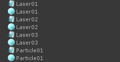
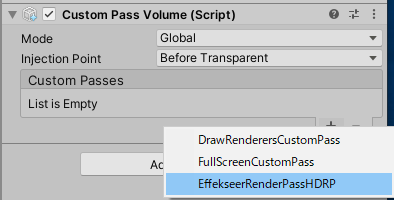
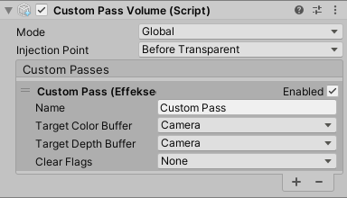
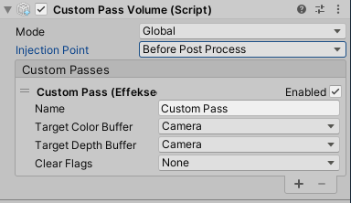

# 使い方

## サンプルプロジェクト

下記の場所にEffekseerプラグインを使用したサンプルシーンがあります。

- Example/EfkBasic
- Example/EfkTimeline


## リソースファイルについて

Unityのプロジェクトにエフェクトプロジェクトファイル(*.efkproj)、出力済エフェクト(*.efk)やテクスチャ、サウンドを配置します。  
\*.efk,efkprojファイルをインポートすると、.efk,efkprojファイルのほかにEffectAssetが生成されます。 



.efk,efkprojファイルは削除しても問題ありません。
また、現在はカスタムパッケージ作成の時に.efk,efkprojファイルを含めてはいけません。

### Scale

読み込んだエフェクトの大きさが小さいことがあります。その場合は、EffectAsssetを選択し、**Scale** のパラメーターを変更します。
EffectEmitterのScaleを変更することでエフェクトの大きさを変更することもできますが、この方法だとエフェクトの設定によっては拡大されないことがあります。


## エミッタを使って再生する方法

### 準備

エフェクトのエミッタコンポーネントをGameObjectにAddすることで、  
GameObjectに連動したエフェクトの再生を行うことができます。  

GameObjectに対してEffekseerEmitterを追加します。


### インスペクタのプロパティ

- Effect Asset: 先ほどインポートしたエフェクトアセットを指定します。
- Play On Start: チェックを入れると、シーン開始時(Start()のタイミング)に自動的に再生します。
- IsLooping: 再生終了したら自動的に再生をリクエストします。


### プレビュー

EffekseerEmitterコンポーネントを設定するとシーンビューにプレビュー用のコントローラーが表示されます。
プレイを押さなくともシーンビューから操作してエフェクトをゲームビューでプレビューできます。


### 特徴

設置するエフェクトやキャラクターに追従するようなエフェクトに適しています。

## スクリプトから直接再生する方法

### スクリプト

EffekseerSystem.PlayEffect()を使うことで、スクリプトからエフェクトを再生することができます。  

以下サンプルコードです。

```
void Start()
{
    // エフェクトを取得する。
    EffekseerEffectAsset effect = Resources.Load<EffekseerEffectAsset> ("Laser01");
    // transformの位置でエフェクトを再生する
    EffekseerHandle handle = EffekseerSystem.PlayEffect(effect, transform.position);
    // transformの回転を設定する。
    handle.SetRotation(transform.rotation);
}
```

### 特徴

PlayEffect()で再生した場合は自動で位置回転は変わりません。  
もし動かしたいときは手動で設定してやる必要があります。  

ヒットエフェクトや爆発エフェクトなど、シンプルに使いたいときに適しています。

## Universal (Light Weight) Render Pipeline

Effekseer は Universal(Light Weight) Render Pipeline に対応しています。.
URP(LWRP)はUnityでは標準に含まれていないため、URPの場合、*ScriptsExternal/EffekseerURPRenderPassFeature.cs*  LWRPの場合、*ScriptsExternal/EffekseerRendererLWRP.cs* からコメントアウトを外してください。


Effekseerのエフェクトを表示するために *Custom Forward Render* を使用します。

*URP*  *Assets -> Create -> Rendering -> Universal Render Pipeline -> Forward Render* から *Forward Render Asset* を作成します。

*LWRP*  *Assets -> Create -> Rendering -> Lightweight Render Pipeline -> Forward Render* から *Forward Render Asset* を作成します。


現在使用している *Pipeline Asset* の *Renderer Type* を *Custom* に変更します。 *Data* に先ほど作成した *Forward Render Asset* を設定します。


先ほど作成した *Forward Render Asset* の *Render Features* に *EffekseerRenderer* を追加します。


## High Definition Render Pipeline

Effekseer は High Definition Render Pipeline に対応しています。.
HDRPはUnityでは標準に含まれていないため、*ScriptsExternal/EffekseerRendererHDRP.cs* からコメントアウトを外してください。


カメラに *CustomPassVolume* コンポーネントを追加します。


*CustomPasses* に *EffekseerRendererHDRP* を追加します。





*Injection Point* を *Before Post Process* に変更します。



## モバイル環境

EffekseerSettingsから歪みを無効化すると高速化します。

## ネットワーク機能

ネットワーク経由でUnityで再生しているエフェクトを外部からアプリケーションの起動中に編集することができます。


Effekseer SettingsにEffekseerから接続するためのポートを指定します。DoStartNetworkAutomaticallyをOnにするか、EffekseerSystemのStartNetworkを実行します。
そうすると、Effekseerからエフェクトを編集できるようになります。他のコンピューターからエフェクトを編集するためにはファイヤーウォールの設定でポート開放する必要があります。


